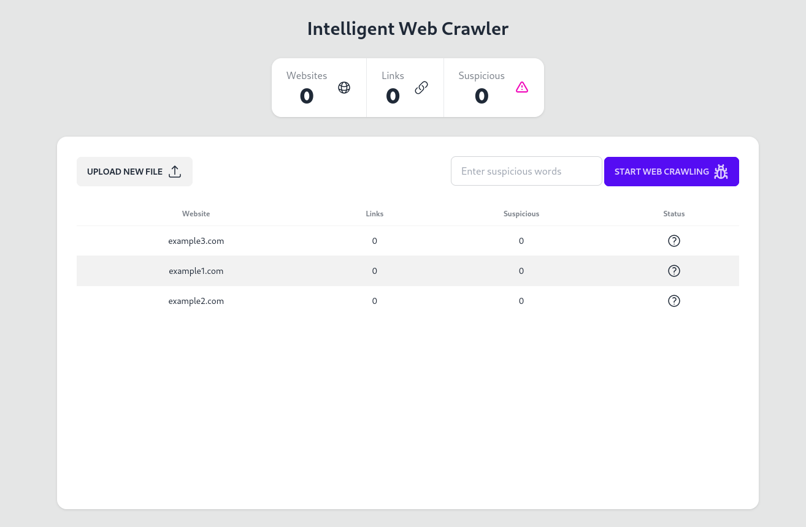

# Intelligent Web Crawler

A simple web application to crawl webpages and check for suspicious words. Developed for fun and as a hobby project to experiment with FastAPI.



## Features

- **Upload**: Upload a CSV containing URLs to start the crawling process.
- **Suspicious Word Detection**: The crawler checks webpages for any suspicious words specified by the user.
- **Real-time Feedback**: The application provides real-time feedback on the webpages being scanned and the detection of suspicious words.
  
## Tech Stack

- **Backend**: FastAPI
- **Web Templating**: Jinja2
- **Styling**: TailwindCSS with DaisyUI
- **Frontend Enhancements**: HTMX and Hyperscript
- **Deployment**: Docker and docker-compose
- **Crawler**: Scrapy

## How to Run

Ensure you have Docker and docker-compose installed.

1. Clone the repository:
   ```bash
   git clone <repository-url>
    ```
2. Navigate to the project directory:
    ```bash
    cd <project-directory>
    ```
3. Use docker-compose to build and run the application:
    ```bash
    docker-compose up --build
    ```
4. The application should now be running at http://localhost:8000.

## Usage
1. Go to the homepage at http://localhost:8000.
2. Upload a .csv file containing the URLs you want to crawl.
3. Input suspicious words for the crawler to detect.
4. Start the web crawling process and monitor the results in real-time. (Integration with the crawler is currently pending)
## Feedback & Contributions
Feedback is welcome! Feel free to open an issue or submit a pull request.

## License
This project is open-source and available under the MIT License.
